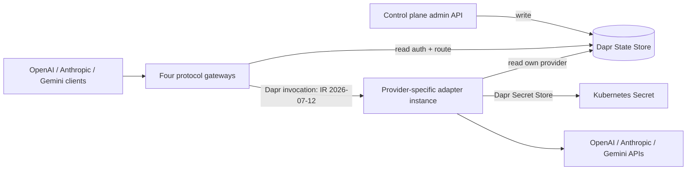

# gwai

gwai is a provider-neutral AI gateway. Four independent client gateways and
four provider adapters meet only at a validated, versioned intermediate
representation (IR). Adding a client or provider protocol therefore adds one
translator instead of a converter for every client/provider pair.

## Supported protocol edges

| Direction | Protocol | Endpoint / provider kind |
| --- | --- | --- |
| Client gateway | OpenAI Chat Completions | `POST /v1/chat/completions` |
| Client gateway | OpenAI Responses | `POST /v1/responses` |
| Client gateway | Anthropic Messages | `POST /v1/messages` |
| Client gateway | Gemini GenerateContent | `POST /v1beta/models/{qualified-model}:generateContent` |
| Provider adapter | OpenAI Chat Completions | `openai-chat` |
| Provider adapter | OpenAI Responses | `openai-responses` |
| Provider adapter | Anthropic Messages | `anthropic` |
| Provider adapter | Gemini GenerateContent | `gemini` |

Every gateway can route to every adapter when the requested semantics belong to
the portable subset. Text, system instructions, images, function tools/calls/
results, common sampling controls, stop reasons and token usage cross the IR.
Streaming, stateful conversations, hosted tools, reasoning/thinking and
structured output are rejected explicitly rather than silently discarded.
See [protocol compatibility](docs/protocol-compatibility.md) for exact limits.

## Architecture



Gateways contain no provider HTTP client and adapters contain no client-gateway
logic. The selected `adapter_app_id` is resolved from state and invoked through
Dapr at `/v1/generate`. The control plane is not on the inference request path.
The contract is [`2026-07-12.schema.json`](api/ir/2026-07-12.schema.json).

## What works

- CRUD lifecycle APIs for users, virtual keys and providers.
- One-time virtual-key disclosure with exact `provider/model` allowlists,
  expiry and user/key/provider disablement.
- Direct data-plane reads and provider-specific Dapr service invocation.
- Per-provider identities, Secret scopes, Dapr mTLS/tokens/ACLs and retries.
- Generic Helm lists for any mix of the four gateways and provider adapters.
- Non-root distroless services and persistent Valkey state for local k3s.
- Race-tested translators and an E2E path that sends all four client protocols
  through one adapter while the control plane is unavailable.

## Local k3s quick start

Required tools: Go 1.26, a Docker-compatible CLI, k3s, kubectl, Dapr 1.18,
Helm 3, curl and jq.

```bash
make local-deploy
kubectl -n gwai get pods
make e2e-k3s
```

The default chart exposes all four gateways and deploys one Anthropic adapter
with provider slug `anthropic` and Dapr app ID `gwai-anthropic`. Follow
[getting started](docs/getting-started.md) for real credentials and additional
providers.

## Development

```bash
make check       # formatting, vet, race tests, contract checks, Helm lint
make build       # all control-plane, gateway and adapter binaries
make images      # all nine OCI images
make helm-lint
```

Runtime Go code has no third-party modules. Infrastructure dependencies are
recorded in [dependencies](docs/dependencies.md).

## Project status

This is pre-release software. Before public exposure, add streaming, quotas,
audit events, external observability, provider failover and a production-grade
high-availability state store. IR `2026-07-12` is intentionally incompatible
with the earlier pre-release IR; no automatic state or contract migration is
provided.
