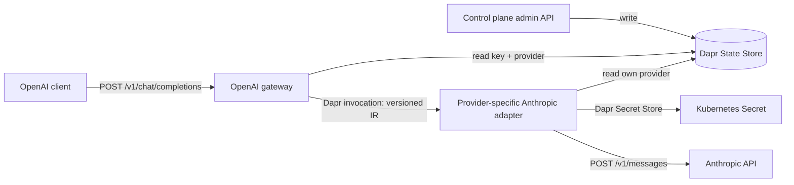

# gwai

gwai is a provider-neutral AI gateway. It separates lifecycle management from
request translation and uses a versioned intermediate representation (IR) so a
new client API or provider needs one translator, not a converter for every
client/provider pair.

The current vertical slice accepts OpenAI-compatible Chat Completions and sends
Anthropic Messages requests. The control plane manages users, virtual keys, and
provider configurations; it is not on the data-plane request path.

## What works

- CRUD lifecycle APIs for users, virtual keys, and providers.
- One-time virtual-key disclosure; only a SHA-256 digest and display prefix are
  persisted.
- Exact per-key allowlists using `provider-slug/upstream-model`, expiry, and
  user/key/provider disablement.
- OpenAI Chat Completions input for text, image URLs/data URLs, system and
  developer messages, tools, tool calls, and tool results.
- Anthropic Messages output with tool and usage translation.
- Direct data-plane reads through Dapr State Store and provider-specific Dapr
  service invocation; gateways never invoke the control plane.
- Per-provider adapter identities, Kubernetes Secret scopes, Dapr mTLS, tokens,
  ACLs, API allowlists, and retry policy.
- A Helm chart with non-root distroless services and a persistent Valkey state
  store for local k3s.

Streaming is intentionally rejected with an explicit OpenAI-style error in
this first slice. See [API compatibility](docs/openai-compatibility.md) for the
exact supported surface.

## Architecture



The detailed boundaries and request sequence are in
[Architecture](docs/architecture.md). The wire contract is
[`2026-07-11.schema.json`](api/ir/2026-07-11.schema.json).

## Local k3s quick start

Required tools: Go 1.26, a Docker-compatible CLI, k3s, kubectl, Dapr 1.18,
Helm 3, curl, and jq.

```bash
make local-deploy
kubectl -n gwai get pods
```

The default chart creates one adapter instance with provider slug `anthropic`
and Dapr app ID `gwai-anthropic`. To verify the whole path without an external
API key:

```bash
make e2e-k3s
```

For a real provider and provisioning calls, follow
[Getting started](docs/getting-started.md).

## Development

```bash
make check       # formatting, vet, race-enabled tests, Helm lint
make build       # bin/control-plane, bin/openai-gateway, bin/anthropic-adapter
make images      # local OCI images
make helm-lint
```

Runtime code has no third-party Go modules. Infrastructure dependencies and
their rationale are recorded in [Dependencies](docs/dependencies.md).

## Project status

This is a pre-release vertical slice. The provider/model state schema introduced
here is intentionally incompatible with the earlier model-alias prototype; no
automatic migration is provided. Before public exposure, add streaming,
quotas/rate limits, audit events, external observability, provider failover, and
a production-grade high-availability state store.
