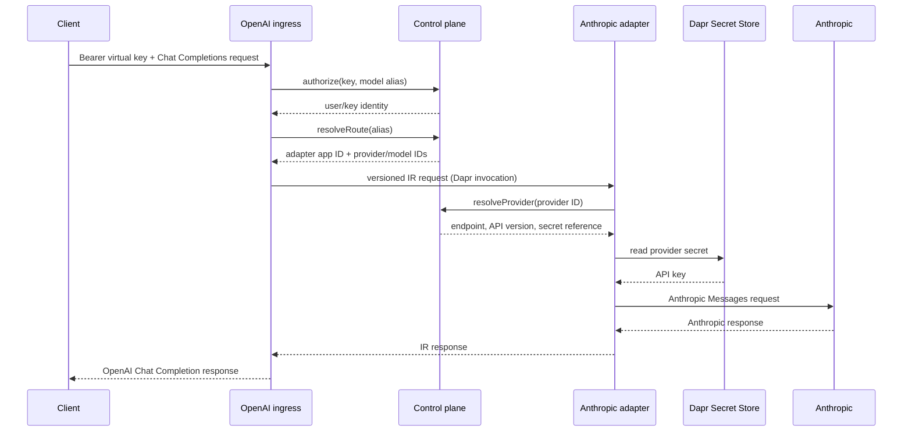

# Architecture

## Goals

gwai keeps client compatibility, provider compatibility, and lifecycle policy
independent. If there are `C` client protocols and `P` provider protocols, the
adapter count is `C + P`, rather than `C × P` direct converters.

The system has two subsystems:

- The control plane owns users, virtual keys, providers, logical model aliases,
  authorization, and route resolution.
- The data plane owns public protocol parsing, the canonical IR, provider
  protocol generation, and response translation.

## Services

| Service | Public responsibility | Internal dependencies |
| --- | --- | --- |
| `gwai-control-plane` | Admin CRUD API | Dapr State Store |
| `gwai-openai-gateway` | `POST /v1/chat/completions` | Control plane and selected adapter through Dapr invocation |
| `gwai-anthropic-adapter` | None; accepts IR only | Control plane, Dapr Secret Store, Anthropic HTTP API |

The provider record selects an adapter by Dapr app ID. A model maps a stable
client alias to a provider and upstream model ID. Neither the ingress adapter
nor the IR contains an Anthropic API key.

## Request sequence

## Intermediate representation

The IR is a versioned wire protocol, not a lowest-common-denominator SDK type.
Version `2026-07-01` represents:

- system, user, assistant, and tool messages;
- text and image content;
- tool definitions, calls, results, and tool selection;
- common generation controls and token usage;
- a resolved provider route that contains identifiers, never credentials.

Adapters must reject semantics they cannot preserve. Silently dropping an
unsupported parameter is treated as a compatibility bug. The JSON Schema in
[`api/ir`](../api/ir/2026-07-01.schema.json) is the external contract; Go types
and validation live in `internal/ir`.

## Control-plane persistence

Each resource is stored under a separate key. Transactional secondary indexes
map model aliases and virtual-key digests to resource IDs; collection indexes
support listing. Mutations use a Dapr state transaction and ETags. Valkey is the
local state-store implementation, but domain code only knows the small
`state.Store` interface.

The chart currently holds the control plane at one replica. ETags prevent lost
index updates, but create-only uniqueness across multiple replicas requires a
distributed lock or a database-native unique constraint before horizontal
control-plane scaling.

## Security boundaries

- Admin APIs require a distinct control-plane Bearer token.
- Client virtual keys are disclosed once and stored as SHA-256 digests.
- Provider records contain a Dapr secret reference, not credential material.
- Dapr mTLS identifies callers; service-invocation ACLs restrict methods.
- Random Dapr API and app tokens authenticate app-to-sidecar and
  sidecar-to-app traffic.
- The bundled Valkey endpoint uses a generated, upgrade-stable password.
- Per-service Dapr API allowlists expose only `state`, `invoke`, or `secrets` as
  required.
- The Anthropic service account can read only the Kubernetes Secret names in
  `anthropicAdapter.secretNames`; Dapr secret scopes repeat that restriction.
- Application containers run as UID/GID 65532 with a read-only root filesystem
  and no Linux capabilities.

## Availability and failure behavior

The gateway and adapters are stateless. The control-plane deployment uses a
zero-unavailable rolling update. A Dapr resiliency policy covers Kubernetes
endpoint rotation, and the read-only control-plane client retries one completed
transient Dapr failure while honoring the request context.

Provider failures are normalized: rate limits remain HTTP 429; provider
authentication, malformed responses, and network failures are returned as a
sanitized gateway error. Provider response bodies and credentials are not sent
to clients or logged.
