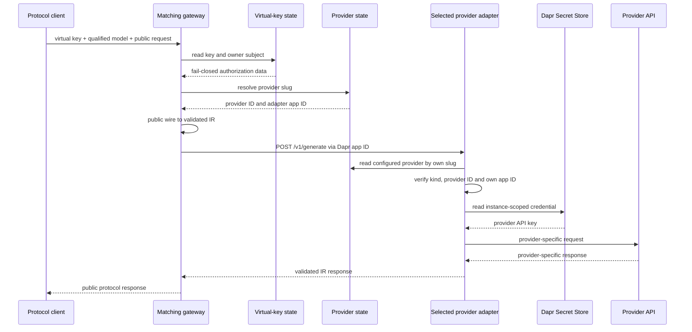

# Architecture

## Boundaries

gwai separates client compatibility, provider compatibility and lifecycle
policy. For `C` client protocols and `P` provider protocols, it needs `C + P`
IR translations rather than `C × P` direct converters.

- The resource control plane owns users and provider configurations.
- The virtual-key control plane independently owns key lifecycle and the
  authorization projection of key owners.
- A gateway owns exactly one public client protocol and translates wire ↔ IR.
- An adapter owns exactly one provider protocol and translates IR ↔ wire.
- `internal/dataplane.Dispatcher` is the only shared gateway execution path:
  authorize, resolve a route, validate IR, invoke `/v1/generate`, validate IR.
- Data-plane processes read current entities through Dapr State Store; they do
  not invoke either control-plane service.

| Service | Public responsibility | Runtime dependencies |
| --- | --- | --- |
| `gwai-control-plane` | User and provider CRUD | private control state, provider state, subject sync/fence |
| `gwai-virtual-key-control-plane` | Virtual-key CRUD | virtual-key state, provider state |
| `gwai-openai-gateway` | OpenAI Chat Completions | virtual-key state, provider state, selected adapter app ID |
| `gwai-openai-responses-gateway` | OpenAI Responses | virtual-key state, provider state, selected adapter app ID |
| `gwai-anthropic-gateway` | Anthropic Messages | virtual-key state, provider state, selected adapter app ID |
| `gwai-gemini-gateway` | Gemini GenerateContent | virtual-key state, provider state, selected adapter app ID |
| Provider adapter instance | Internal IR only | provider state, Secret Store, one provider HTTP API |

No gateway imports or calls a provider adapter. No adapter knows which gateway
originated a request. Protocol packages may define their own wire DTOs, but the
two translation directions remain separate and never call each other.

## Routing and request sequence

Each provider has an immutable DNS-label `slug`, one of four `kind` values and
an explicit `adapter_app_id`. A client model is
`provider-slug/upstream-model`; only the first `/` separates routing metadata.
Helm creates one workload and Dapr identity per provider account. The persisted
and deployed app IDs must match.

Dapr supplies discovery, mTLS, invocation and load balancing among replicas
sharing the provider-specific app ID. The adapter validates the resolved route
again before loading a credential, preventing cross-instance dispatch.

## Control-plane coordination

The public admin API is deliberately split. `gwai-control-plane` serves only
`/v1/users` and `/v1/providers`; `gwai-virtual-key-control-plane` serves only
`/v1/virtual-keys`. Both use the same admin Bearer-token contract, but they have
separate deployments, Dapr identities and Services.

Gateways cannot read the private user registry. Instead, the virtual-key state
contains a minimal `KeySubject`: user ID, status, monotonically increasing
revision, deletion flag and update time. The resource control plane synchronizes
that projection through authenticated Dapr calls:

- `POST /internal/v1/subjects/sync` creates or advances a subject revision;
- `POST /internal/v1/subjects/fence` atomically verifies that the per-user key
  index is empty and persists a non-reversible deletion tombstone.

Stale revisions and equal revisions with different authorization state
(`user_id`, status or deletion flag) conflict; `updated_at` is observational and
the first committed timestamp is retained on an idempotent retry. Every key
create, owner change and delete touches the subject ETag in the same transaction
as its entity and per-user index. This prevents key creation from racing a user
deletion fence.

The ordering deliberately fails closed. User disablement is synchronized before
the private user record changes; activation is synchronized afterwards. A
missing, disabled or deleted subject always makes gateway authorization fail.
The resource process serializes user lifecycle sagas, and repository writes
reject stale expected records, so update and deletion cannot interleave inside
the supported single-writer deployment.
User creation persists the canonical user before synchronization. If the Dapr
result is ambiguous, the API reports failure but retains that record; a missing
projection denies authorization and a later full user `PUT` advances the
revision and repairs synchronization. User writes therefore require the
virtual-key service, while provider administration does not. Existing-key
administration can continue with the resource service down because subjects and
provider records are local to its dependencies.

## Intermediate representation

IR `2026-07-12` represents:

- leading system instructions and user/assistant/tool messages;
- text and JPEG/PNG/GIF/WebP images;
- JSON-Schema function definitions, choices, calls and structured results;
- Gemini thought signatures attached only to function calls;
- optional output-token limits, temperature `0..1`, top-p and stop sequences;
- normalized finish reasons and total input/output token usage;
- separate cache-creation and cache-read token detail.

`max_output_tokens` is optional so the selected adapter can own its default and
upper bound. Provider endpoints and credentials never enter IR. An adapter
rejects a valid IR feature when its provider cannot represent it—for example,
Responses has no stop-sequence parameter and Gemini cannot fetch arbitrary
image URLs. The published schema is
[`2026-07-12.schema.json`](../api/ir/2026-07-12.schema.json).

## Persistence

The chart creates three Dapr `state.redis` components backed by separate Valkey
logical databases:

| Component | Default DB | Records | Scoped applications |
| --- | ---: | --- | --- |
| `gwai-control-state` | 0 | users and email index | resource control plane only |
| `gwai-provider-state` | 1 | providers, slug and app-ID indexes | both control planes, gateways and adapters |
| `gwai-virtual-key-state` | 2 | key hashes, subjects and per-user indexes | virtual-key control plane and gateways |

Each component uses `keyPrefix: name`, so its scoped app IDs see the same keys
inside that domain without sharing keys with another component. Provider
credentials are never state values; provider records contain only Secret Store
references.

Resources use separate keys. Collection and unique lookup indexes are updated
with their entity in a Dapr state transaction and guarded with ETags. Virtual-key
owner indexes and subject touches belong to those same single-store
transactions. No transaction spans state components.

Each administrative writer remains at one replica because its compound
uniqueness checks also use a process-local mutex. ETags prevent lost updates,
but safe horizontal writers still require a distributed lock or database-native
unique constraints. Their Deployments use the `Recreate` strategy so an upgrade
does not temporarily overlap two writers.

## Security and availability

- Admin APIs require a separate control-plane Bearer token.
- Virtual keys are disclosed once and persisted as SHA-256 digests.
- Provider records contain Secret references, never credential material.
- Private control state is scoped only to `gwai-control-plane`; adapters never
  receive virtual-key state and gateways never receive private user state.
- Subject synchronization is restricted to the resource control-plane Dapr
  identity and protected by a virtual-key-specific application token that is
  not shared with provider adapters.
- Every adapter Dapr ACL allows `/v1/generate` only from configured gateways.
- Every adapter has a ServiceAccount, Role, Secret scope and allowlist.
- Dapr mTLS/API/app tokens, non-root containers, read-only filesystems and
  dropped capabilities reduce the attack surface.

Gateway and adapter replicas are stateless. Inference continues with both
control-plane Deployments unavailable while the virtual-key and provider state
components, Dapr, the selected adapter and upstream provider remain healthy.
Provider 429 responses remain 429; credential values and provider response
bodies are not returned to clients.

## Pre-release state compatibility

The former 0.x layout stored users, providers and virtual keys in one
`gwai-state` component. The split layout neither reads nor migrates that
registry. A 0.x upgrade therefore requires a fresh installation or an explicit
reset/reprovisioning of pre-release resources. Reusing the old persistent Valkey
volume without that decision can leave inaccessible legacy data and must not be
treated as a successful migration.
