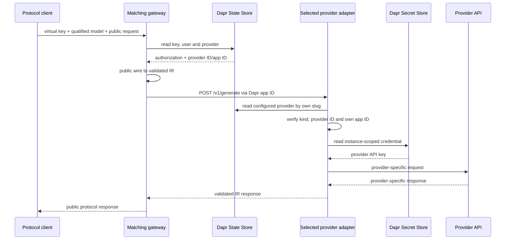

# Architecture

## Boundaries

gwai separates client compatibility, provider compatibility and lifecycle
policy. For `C` client protocols and `P` provider protocols, it needs `C + P`
IR translations rather than `C × P` direct converters.

- The control plane owns administrative mutations for users, virtual keys and
  provider configurations.
- A gateway owns exactly one public client protocol and translates wire ↔ IR.
- An adapter owns exactly one provider protocol and translates IR ↔ wire.
- `internal/dataplane.Dispatcher` is the only shared gateway execution path:
  authorize, resolve a route, validate IR, invoke `/v1/generate`, validate IR.
- Data-plane processes read current entities through Dapr State Store; they do
  not invoke the control plane.

| Service | Public responsibility | Runtime dependencies |
| --- | --- | --- |
| `gwai-control-plane` | Admin CRUD API | Dapr State Store |
| `gwai-openai-gateway` | OpenAI Chat Completions | State Store, selected adapter app ID |
| `gwai-openai-responses-gateway` | OpenAI Responses | State Store, selected adapter app ID |
| `gwai-anthropic-gateway` | Anthropic Messages | State Store, selected adapter app ID |
| `gwai-gemini-gateway` | Gemini GenerateContent | State Store, selected adapter app ID |
| Provider adapter instance | Internal IR only | State Store, Secret Store, one provider HTTP API |

No gateway imports or calls a provider adapter. No adapter knows which gateway
originated a request. Protocol packages may define their own wire DTOs, but the
two translation directions remain separate and never call each other.

## Routing and request sequence

Each provider has an immutable DNS-label `slug`, one of four `kind` values and
an explicit `adapter_app_id`. A client model is
`provider-slug/upstream-model`; only the first `/` separates routing metadata.
Helm creates one workload and Dapr identity per provider account. The persisted
and deployed app IDs must match.

Dapr supplies discovery, mTLS, invocation and load balancing among replicas
sharing the provider-specific app ID. The adapter validates the resolved route
again before loading a credential, preventing cross-instance dispatch.

## Intermediate representation

IR `2026-07-12` represents:

- leading system instructions and user/assistant/tool messages;
- text and JPEG/PNG/GIF/WebP images;
- JSON-Schema function definitions, choices, calls and structured results;
- Gemini thought signatures attached only to function calls;
- optional output-token limits, temperature `0..1`, top-p and stop sequences;
- normalized finish reasons and total input/output token usage;
- separate cache-creation and cache-read token detail.

`max_output_tokens` is optional so the selected adapter can own its default and
upper bound. Provider endpoints and credentials never enter IR. An adapter
rejects a valid IR feature when its provider cannot represent it—for example,
Responses has no stop-sequence parameter and Gemini cannot fetch arbitrary
image URLs. The published schema is
[`2026-07-12.schema.json`](../api/ir/2026-07-12.schema.json).

## Persistence

Resources use separate keys. Transactional secondary indexes map provider
slugs, adapter app IDs, user emails and virtual-key digests to IDs; collection
indexes support administration. Mutations use Dapr state transactions and
ETags. Domain code depends only on the narrow `state.Store` interface.

The Redis component uses `keyPrefix: name`, so all scoped gwai app IDs see the
same logical registry. Dapr's default app-ID prefix would isolate each service.
This shared entity schema removes control-plane availability from inference but
requires migration or an explicit pre-release reset after incompatible changes.

The chart keeps the control plane at one replica. ETags prevent lost index
updates, but safe multi-writer uniqueness needs a distributed lock or a
database-native unique constraint.

## Security and availability

- Admin APIs require a separate control-plane Bearer token.
- Virtual keys are disclosed once and persisted as SHA-256 digests.
- Provider records contain Secret references, never credential material.
- State is scoped to the control plane, configured gateways and adapters.
- Every adapter Dapr ACL allows `/v1/generate` only from configured gateways.
- Every adapter has a ServiceAccount, Role, Secret scope and allowlist.
- Dapr mTLS/API/app tokens, non-root containers, read-only filesystems and
  dropped capabilities reduce the attack surface.

Gateway and adapter replicas are stateless. Inference continues with the
control-plane Deployment unavailable while State Store, Dapr, the selected
adapter and upstream provider remain healthy. Provider 429 responses remain
429; credential values and provider response bodies are not returned to clients.
