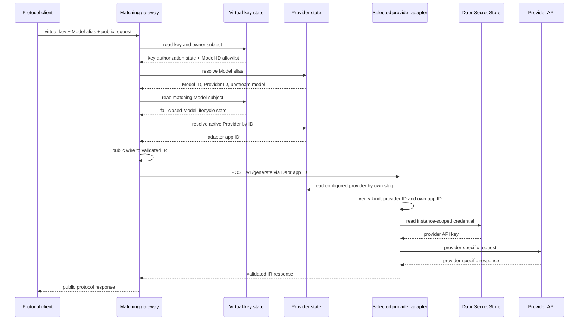

# Architecture

## Boundaries

gwai separates client compatibility, provider compatibility and lifecycle
policy. For `C` client protocols and `P` provider protocols, it needs `C + P`
IR translations rather than `C × P` direct converters.

- The resource control plane owns users and the Model/Provider routing catalog.
- The virtual-key control plane independently owns key lifecycle and the
  authorization/reference projections for key owners and Models.
- The administrative WebUI is a server-rendered backend-for-frontend (BFF). It
  owns browser sessions and delegates lifecycle commands to the two control
  planes; it owns no domain state.
- A gateway owns exactly one public client protocol and translates wire ↔ IR.
- An adapter owns exactly one provider protocol and translates IR ↔ wire.
- `internal/dataplane.Dispatcher` is the only shared gateway execution path:
  authorize, resolve a route, validate IR, invoke `/v1/generate`, validate IR.
- Data-plane processes read current entities through Dapr State Store; they do
  not invoke either control-plane service.

| Service | Public responsibility | Runtime dependencies |
| --- | --- | --- |
| `gwai-admin-webui` | Browser UI and admin sessions | resource and virtual-key control-plane APIs |
| `gwai-control-plane` | User, Model and Provider CRUD | private control state, provider state, subject sync/fence |
| `gwai-virtual-key-control-plane` | Virtual-key CRUD | virtual-key state only |
| `gwai-openai-gateway` | OpenAI Chat Completions | virtual-key state, provider state, selected adapter app ID |
| `gwai-openai-responses-gateway` | OpenAI Responses | virtual-key state, provider state, selected adapter app ID |
| `gwai-anthropic-gateway` | Anthropic Messages | virtual-key state, provider state, selected adapter app ID |
| `gwai-gemini-gateway` | Gemini GenerateContent | virtual-key state, provider state, selected adapter app ID |
| Provider adapter instance | Internal IR only | provider state, Secret Store, one provider HTTP API |

No gateway imports provider-adapter code or is statically paired with an
adapter. It invokes only the protocol-neutral `/v1/generate` contract at the
app ID selected from Provider state. No adapter knows which gateway originated
a request. Protocol packages may define their own wire DTOs, but the two
translation directions remain separate and never call each other.

## Routing and request sequence

Each Model has a globally unique immutable client alias, a Provider ID and an
upstream model identifier. Each Provider has an immutable DNS-label `slug`, one
of four `kind` values and an explicit `adapter_app_id`. Helm creates one workload
and Dapr identity per provider account. The persisted and deployed app IDs must
match. Moving a Model to another Provider changes the selected adapter without
changing the public alias or introducing a protocol-specific gateway path.

Dapr supplies discovery, mTLS, invocation and load balancing among replicas
sharing the provider-specific app ID. The adapter validates the resolved route
again before loading a credential, preventing cross-instance dispatch.

## Control-plane coordination

The public admin API is deliberately split. `gwai-control-plane` serves
`/v1/users`, `/v1/models` and `/v1/providers`;
`gwai-virtual-key-control-plane` serves only `/v1/virtual-keys`. Both use the
same admin Bearer-token contract, but they have separate deployments, Dapr
identities and Services.

Gateways cannot read the private user registry. Instead, the virtual-key state
contains a minimal `KeySubject`: user ID, status, monotonically increasing
revision, deletion flag and update time. The resource control plane synchronizes
that projection through authenticated Dapr calls:

- `POST /internal/v1/subjects/sync` creates or advances a subject revision;
- `POST /internal/v1/subjects/fence` atomically verifies that the per-user key
  index is empty and persists a non-reversible deletion tombstone.

Stale revisions and equal revisions with different authorization state
(`user_id`, status or deletion flag) conflict; `updated_at` is observational and
the first committed timestamp is retained on an idempotent retry. Every key
create, owner change and delete touches the subject ETag in the same transaction
as its entity and per-user index. This prevents key creation from racing a user
deletion fence.

Virtual keys contain a required, non-empty set of stable Model IDs. Canonical
Models live beside Providers in provider state, while virtual-key state contains
a minimal `ModelSubject`: Model ID, immutable alias, status, revision, deletion
flag and update time. The resource control plane uses two additional
authenticated Dapr calls:

- `POST /internal/v1/model-subjects/sync` creates or advances a Model subject;
- `POST /internal/v1/model-subjects/fence` atomically verifies that the
  per-Model key index is empty and persists a deletion tombstone.

Every key create, Model-set change and delete updates the relevant per-Model
indexes and touches all affected Model-subject ETags in the same virtual-key
state transaction. This serializes a Model deletion fence against concurrent
key assignment without a transaction spanning state components. Provider-to-
Model integrity stays within provider state: a per-Provider Model index blocks
Provider deletion until its Models are removed.

The ordering deliberately fails closed. User or Model disablement is
synchronized before its canonical record changes; activation is synchronized
afterwards. A missing, stale, disabled or deleted subject always makes gateway
authorization fail.
The resource process serializes user lifecycle sagas, and repository writes
reject stale expected records, so update and deletion cannot interleave inside
the supported single-writer deployment.
User creation persists the canonical user before synchronization. If the Dapr
result is ambiguous, the API reports failure but retains that record; a missing
projection denies authorization and a later full user `PUT` advances the
revision and repairs synchronization. Model create/update follows the same
repairable pattern; deletion uses its idempotent fence. User and Model writes
therefore require the virtual-key service, while Provider administration that
does not violate the Provider-to-Model dependency remains local. Existing-key
administration can continue with the resource service down because the user and
Model projections required to validate relationships are local to virtual-key
state.

## Administrative WebUI

The WebUI composes the split administrative APIs without changing their
ownership. Its Go backend renders HTML and uses authenticated Dapr invocation
to reach the resource control plane for users/providers/models and the
virtual-key control plane for keys. The browser never receives the control-plane
bearer token and never calls either API directly, so the deployment needs no
browser CORS policy. The WebUI has no State Store scope and does not enter the
inference path.

An administrator presents the existing admin token only to the login form. A
short-lived challenge signed with an independent process-local random key
protects login without allocating anonymous
server state. Successful authentication creates a short-lived, opaque
server-side session identified by an `HttpOnly`, `SameSite=Strict` cookie, with
`Secure` enabled for HTTPS deployments. Mutating forms require a per-session
CSRF token; key creation also requires a single-use operation token. Responses
containing administrative data or the one-time plaintext virtual key use
`Cache-Control: no-store`; the key is rendered directly in the creation
response, is not retained by the WebUI and is not placed in browser storage.
Edit, status and delete-confirmation forms use strong ETags with `If-Match` to
reject stale lifecycle actions. An ambiguous key-creation response does not
produce an immediate replacement form; operators are directed to inspect and
delete any possibly created key before retrying. Every mutating BFF invocation
uses an unknown-length streaming body to suppress Dapr automatic retries;
read-only calls remain retryable. Ambiguous mutation responses render no repeat
action and direct the operator to reload current state. Shutdown grace exceeds
the request deadline so in-flight lifecycle responses can complete during
rollout.

Dapr ACLs restrict the WebUI identity to the users, providers, models and
virtual-key route families. Dapr 1.18 resolves a collection ACL node as a
prefix before its item wildcard, so each collection rule carries the union of
collection and item verbs for compatibility. The method-aware Go mux remains
authoritative: unsupported collection/item verb combinations still return
`405`, and the BFF client exposes only concrete lifecycle methods.

Templates and static assets are compiled into the Go binary. There are no CDN
requests and no JavaScript package-manager/runtime dependency. A strict Content
Security Policy, frame denial, MIME sniffing protection and referrer policy
reduce the browser attack surface. The default Kubernetes Service remains
cluster-internal; production exposure requires a TLS-terminating ingress or
equivalent trusted proxy.

## Intermediate representation

IR `2026-07-12` represents:

- leading system instructions and user/assistant/tool messages;
- text and JPEG/PNG/GIF/WebP images;
- JSON-Schema function definitions, choices, calls and structured results;
- Gemini thought signatures attached only to function calls;
- optional output-token limits, temperature `0..1`, top-p and stop sequences;
- normalized finish reasons and total input/output token usage;
- separate cache-creation and cache-read token detail.

`max_output_tokens` is optional so the selected adapter can own its default and
upper bound. Provider endpoints and credentials never enter IR. An adapter
rejects a valid IR feature when its provider cannot represent it—for example,
Responses has no stop-sequence parameter and Gemini cannot fetch arbitrary
image URLs. The published schema is
[`2026-07-12.schema.json`](../api/ir/2026-07-12.schema.json).

## Persistence

The chart creates three Dapr `state.redis` components backed by separate Valkey
logical databases:

| Component | Default DB | Records | Scoped applications |
| --- | ---: | --- | --- |
| `gwai-control-state` | 0 | users and email index | resource control plane only |
| `gwai-provider-state` | 1 | Models, Providers and routing indexes | resource control plane, gateways and adapters |
| `gwai-virtual-key-state` | 2 | keys, user/Model subjects and reference indexes | virtual-key control plane and gateways |

Each component uses `keyPrefix: name`, so its scoped app IDs see the same keys
inside that domain without sharing keys with another component. Provider
credentials are never state values; provider records contain only Secret Store
references.

Resources use separate keys. Collection, unique alias and per-Provider Model
indexes are updated with their entity in a Dapr state transaction and guarded
with ETags. Virtual-key owner/Model indexes and all subject touches belong to
the corresponding key transaction. No transaction spans state components.

Each administrative writer remains at one replica because its compound
uniqueness checks also use a process-local mutex. ETags prevent lost updates,
but safe horizontal writers still require a distributed lock or database-native
unique constraints. Their Deployments use the `Recreate` strategy so an upgrade
does not temporarily overlap two writers.

## Security and availability

- Admin APIs require a separate control-plane Bearer token.
- The WebUI converts a successful admin-token login into an opaque, expiring
  session; the bearer credential remains server-side and every mutation is
  protected against CSRF.
- Virtual keys are disclosed once and persisted as SHA-256 digests.
- Provider records contain Secret references, never credential material.
- Private control state is scoped only to `gwai-control-plane`; adapters never
  receive virtual-key state and gateways never receive private user state.
- User/Model subject synchronization is restricted to the resource control-
  plane Dapr identity and protected by a virtual-key-specific application token
  that is not shared with provider adapters.
- Every adapter Dapr ACL allows `/v1/generate` only from configured gateways.
- Every adapter has a ServiceAccount, Role, Secret scope and allowlist.
- Dapr mTLS/API/app tokens, non-root containers, read-only filesystems and
  dropped capabilities reduce the attack surface.

Gateway and adapter replicas are stateless. Inference continues with both
control-plane Deployments unavailable while the virtual-key and provider state
components, Dapr, the selected adapter and upstream provider remain healthy.
Provider 429 responses remain 429; credential values and provider response
bodies are not returned to clients.

## Pre-release state compatibility

The former 0.x layouts either stored all resources in one `gwai-state`
component or allowed virtual keys to contain qualified model strings. The
current layout requires canonical Models, non-empty Model-ID sets, Model
subjects and per-Model reference indexes. It neither infers these records nor
falls back to permissive string routing. A 0.x upgrade therefore requires a
fresh installation or an explicit reset and reprovisioning of users, Providers,
Models and virtual keys. Reusing an old persistent Valkey volume without that
decision is not a successful migration.
