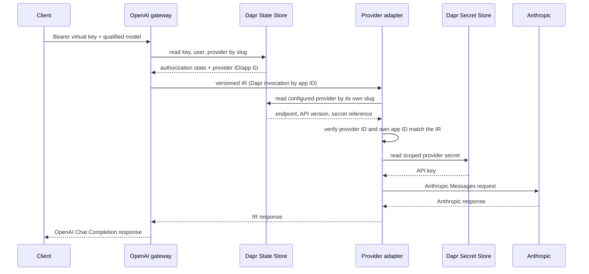

# Architecture

## Boundaries

gwai keeps client compatibility, provider compatibility, and lifecycle policy
independent. If there are `C` client protocols and `P` provider protocols, the
translator count is `C + P`, rather than `C × P` direct converters.

- The control plane owns administrative mutations for users, virtual keys, and
  provider configurations.
- Gateways own public client protocols and translate them to/from the canonical IR.
- Provider adapters own one provider protocol and translate it to/from the IR.
- A read-only runtime library lets data-plane processes read current entities
  directly through Dapr State Store; they never invoke the control plane.

| Service | Public responsibility | Runtime dependencies |
| --- | --- | --- |
| `gwai-control-plane` | Admin CRUD API | Dapr State Store |
| `gwai-openai-gateway` | `POST /v1/chat/completions` | Dapr State Store and selected provider app ID |
| Anthropic adapter instance | None; accepts IR only | Dapr State Store, Secret Store, Anthropic HTTP API |

## Routing and request sequence

Each provider has an immutable DNS-label `slug` and explicit
`adapter_app_id`. A client model is `provider-slug/upstream-model`; only the
first `/` separates routing metadata. Helm creates one adapter workload and
Dapr identity per configured provider account. The persisted app ID and Helm
app ID must match.

The gateway does not know provider-specific HTTP formats, endpoints, or
credentials. An adapter does not know which public client protocol originated
the IR. Dapr provides discovery, mTLS, invocation, and load balancing among
replicas sharing the provider-specific app ID.

## Intermediate representation

The IR is a versioned wire protocol, not a lowest-common-denominator SDK type.
Version `2026-07-11` represents multimodal messages, tools, common generation
controls, usage, finish reasons, and a resolved route containing identifiers
but never credentials. `max_output_tokens` is optional; when absent, the
selected adapter owns the default and optional upper bound.

Adapters reject semantics they cannot preserve. The published contract is
[`2026-07-11.schema.json`](../api/ir/2026-07-11.schema.json); Go types and
validation live in `internal/ir`.

## Persistence

Each resource is stored under a separate key. Transactional secondary indexes
map provider slugs, adapter app IDs, user emails, and virtual-key digests to resource IDs;
collection indexes support administration. Mutations use a Dapr state
transaction and ETags. Valkey is the local backend, while domain code depends
only on the narrow `state.Store` interface.

The Dapr Redis component uses `keyPrefix: name`, so all scoped gwai app IDs see
the same component-prefixed keys. Dapr's default app-id prefix cannot be used
because it would create a different logical registry for every service.

The data plane constructs only the read-only runtime interface, but shares the
same persisted entity schema. This is deliberate and removes control-plane
availability from request processing. Schema changes therefore require an
explicit data migration or, during pre-release development, a documented state
reset.

The chart holds the control plane at one replica. ETags prevent lost index
updates, but create-only uniqueness across multiple replicas requires a
distributed lock or database-native unique constraint before scaling writes.

## Security and availability

- Admin APIs require a distinct control-plane Bearer token.
- Virtual keys are disclosed once and persisted as SHA-256 digests.
- Provider records contain secret references, never credential material.
- Dapr component scopes expose state only to the three service roles.
- Dapr ACLs permit only the OpenAI gateway to invoke `/v1/generate` on each
  provider-specific adapter identity.
- Every adapter has a dedicated ServiceAccount, Kubernetes Role, Dapr secret
  scope, and explicit Secret allowlist.
- Random Dapr API/app tokens, mTLS, non-root containers, read-only filesystems,
  and dropped Linux capabilities reduce the service attack surface.

Gateway and adapter replicas are stateless. The request path continues while
the control-plane Deployment is unavailable, provided the State Store, Dapr,
selected adapter, and upstream provider remain available. Provider rate limits
remain HTTP 429; credentials and provider response bodies are never returned to
clients or logged.
